# Harmonogram — szkielet (fazy względne od T0)

T0 = decyzja finansowa / start developmentu. Czasy orientacyjne dla ~40 min animacji 2D przy średnim zespole `[do weryfikacji po wyborze studia i techniki]`. `/harmonogram` wygeneruje wersję z datami po podaniu T0 i tempa produkcji.

```mermaid
gantt
    title Wanda i jej banda 2 — plan ramowy (miesiące od T0)
    dateFormat X
    axisFormat M%s

    section Development
    Projekty plastyczne, colorscript        :d1, 0, 4
    Test stylistyki Origamków (E3)          :crit, d2, 1, 2
    Test subiektywizacji (E1)               :crit, d3, 1, 2
    Kompozycja piosenek (dema)              :d4, 1, 3

    section Preprodukcja
    Storyboard                              :p1, 3, 4
    Casting głosowy (dzieci + banda/wokale) :p2, 4, 2
    Nagrania dialogów                       :p3, 6, 2
    Animatik (lock)                         :crit, p4, 5, 3
    Finalne nagrania piosenek               :p5, 6, 2

    section Produkcja
    Assety: postacie i rigi (Gniotek pierwszy) :a1, 5, 4
    Assety: światy (Origamki XL)            :a2, 6, 5
    Animacja kat. C (teledyski, efekty)     :crit, a3, 8, 7
    Animacja kat. A/B                       :a4, 9, 7
    FX, kompozycja, render                  :a5, 11, 6

    section Post i dźwięk
    Montaż kroczący                         :s1, 9, 8
    Sound design i muzyka ilustracyjna      :s2, 14, 3
    Zgranie, korekcja, mastery              :s3, 16, 2
```

## Kamienie milowe

| M | Kiedy (od T0) | Co jest gotowe |
|---|---------------|----------------|
| M1 | +2 mies. | testy E1 i E3 zaakceptowane — decyzja o technice |
| M2 | +4 mies. | bible plastyczna + dema piosenek |
| M3 | +8 mies. | animatik lock + finalne nagrania (dialogi, piosenki) — **od tego momentu zmiany scenariusza są drogie** |
| M4 | +11 mies. | wszystkie assety produkcyjne gotowe |
| M5 | +15 mies. | animacja kat. C ukończona (największe ryzyko za nami) |
| M6 | +18 mies. | picture lock → zgranie, mastery |

## Zasady

1. Testy E1/E3 przed animatikiem — one decydują o technice i budżecie.
2. Dialogi i piosenki nagrane PRZED animacją (synchron ust i choreografie do finalnego audio).
3. Sekwencje kat. C startują pierwsze — najdłuższe i najbardziej ryzykowne.
4. Rig Gniotka jako pierwszy asset postaciowy (występuje wszędzie, warianty testują cały pipeline).
