# Harmonogram produkcji — „Wanda i jej banda 2: W przedszkolu"

Wersja 1.0 (na podstawie breakdownu z gałęzi `claude/film-production-assistant-uyoap7`). Daty względne od **T0 = decyzja finansowa / start developmentu**. Po podaniu daty T0 harmonogram przeliczam na daty kalendarzowe.

## 1. Założenia (wejście — do kalibracji)

| Parametr | Wartość robocza | Status |
|----------|----------------|--------|
| Metraż filmu | 42 min (widełki 40–45) | z breakdownu |
| Technika | animacja 2D | `[do weryfikacji — decyzja po testach E1/E3]` |
| Animacja kat. A (dialogi) | 12 min = 720 s | z breakdownu |
| Animacja kat. B (akcja standardowa) | 18 min = 1080 s | z breakdownu |
| Animacja kat. C (efekty, tłumy, 3 teledyski) | 12 min = 720 s | z breakdownu |
| Tempo animacji kat. A | 30 s/tydzień/animator | `[do weryfikacji ze studiem]` |
| Tempo animacji kat. B | 20 s/tydzień/animator | `[do weryfikacji]` |
| Tempo animacji kat. C | 10 s/tydzień/animator | `[do weryfikacji]` |
| Zespół animacji | 6 animatorów | `[do weryfikacji]` |
| Assety postaciowe | ~25 (17 postaci mówiących + Wózek + warianty: Gniotek ×9 form, Kucharz ×2, Wychowawczyni ×2, tłumy ×5 grup) | z postacie.md |
| Środowiska | ~16 (13 światów + warianty „groźne": korytarz, sala, + 3 setupy świetlne pokoju) | z lokacje.md |
| Piosenki | 2 nowe + 1 nowa aranżacja | z piosenki.md |
| Bufor na retake'i i ramp-up | +20% czasu animacji | standard |

## 2. Wyliczenie okna animacji

```
kat. A:  720 s ÷ 30 s/tydz. =  24 tygodnio-animatorów
kat. B: 1080 s ÷ 20 s/tydz. =  54 tygodnio-animatorów
kat. C:  720 s ÷ 10 s/tydz. =  72 tygodnio-animatorów
                     RAZEM = 150 tygodnio-animatorów
÷ 6 animatorów = 25 tygodni  → +20% bufora = 30 tygodni ≈ 7 miesięcy okna animacji
```

Kategoria C to **48% całego wysiłku animacyjnego** przy 28% metrażu — dlatego startuje pierwsza i ma priorytet obsady.

## 3. Etapy

| Etap | Czas | Okno (od T0) | Zależy od | Kamień milowy („gotowe") | Główne ryzyka |
|------|------|--------------|-----------|--------------------------|---------------|
| **D1. Finalny scenariusz** (rewizje, m.in. korekta sc. 8 EXT→INT) | 2 mies. | M0–M2 | — | scenariusz lock | zmiany po animatiku są ~10× droższe |
| **D2. Projekty plastyczne + colorscript** | 4 mies. | M0–M4 | D1 (częściowo równolegle) | bible plastyczna zaakceptowana | 25 assetów postaci, 16 środowisk — wąskie gardło: art director |
| **D3. Testy techniczne E1 (subiektywizacja) i E3 (stylistyka papieru)** | 2 mies. | M1–M3 | wstępne projekty z D2 | decyzja o technice i pipeline | **największe ryzyko projektu** — wynik testów może zmienić budżet |
| **D4. Kompozycja piosenek (dema)** | 2 mies. | M1–M3 | D1 | 3 dema zaakceptowane; umowy praw do piosenki cz. 1 podpisane | prawa do „Jesteś jednym z nas" — zacząć negocjacje w M1 |
| **P1. Storyboard** (30 scen, ~42 min) | 4 mies. | M3–M7 | D1, D2 (projekty głównych postaci) | storyboard kompletny | sekwencje C wymagają najbardziej doświadczonych storyboardzistów |
| **P2. Casting głosowy** (2 dzieci, 6 bandy z wokalem, epizody) | 2 mies. | M4–M6 | D4 (próby wokalne do dem) | obsada zakontraktowana | banda musi śpiewać — casting podwójny (głos + wokal) albo dublerzy wokalni |
| **P3. Nagrania dialogów** | 2 mies. | M6–M8 | P2, D1 | wszystkie dialogi nagrane | głosy dziecięce = krótkie sesje, planować więcej dni studia |
| **P4. Animatik** | 3 mies. | M5–M8 | P1 (kroczący), P3, D4 | **animatik lock (M8)** — metraż potwierdzony | sekwencje sensoryczne bez dialogu (14, 16) mogą zmienić metraż ±3 min |
| **P5. Finalne nagrania piosenek** | 2 mies. | M6–M8 | D4, P2 | 3 finalne miksy piosenek | teledyski animuje się TYLKO do finalnych nagrań |
| **A1. Assety: postacie i rigi** (Gniotek pierwszy) | 4 mies. | M5–M9 | D2, D3 | 25 assetów przez QC | rig Gniotka (9 form) testuje cały pipeline — nie oszczędzać |
| **A2. Assety: środowiska** (Origamki XL najwcześniej) | 5 mies. | M6–M11 | D2, D3 | 16 środowisk przez QC | Origamki = pojedynczy największy asset filmu |
| **A3. Animacja kat. C** (teledyski, E1–E10) | 7 mies. | M8–M15 | P4, P5, A1, A2 (kroczące) | shoty C zaakceptowane | 48% wysiłku animacji; opóźnienie tu = opóźnienie filmu |
| **A4. Animacja kat. A/B** | 7 mies. | M9–M16 | P4, A1, A2 | wszystkie shoty zaakceptowane | — |
| **A5. FX, kompozycja, render** | 6 mies. | M11–M17 | A3/A4 (kroczące) | wszystkie ujęcia w finalnej jakości | odbicia (E7) i teatr cieni (E5) — osobne warstwy kompozycji |
| **S1. Montaż kroczący** | ciągły | M9–M17 | animatik + shoty | picture lock (M17) | — |
| **S2. Sound design + muzyka ilustracyjna** | 3 mies. | M14–M17 | S1 (sekwencje lockowane partiami) | sesja zgraniowa gotowa | subiektywne deformacje dźwięku (sc. 4–5) — pozycja kreatywna, zamówić wcześnie |
| **S3. Zgranie, korekcja, mastery/DCP** | 2 mies. | M17–M19 | S1, S2 | **kopia wzorcowa (M19)** | — |

**Łączny czas produkcji: ~19 miesięcy od T0** (przy założonym zespole; ścieżka krytyczna: D2 → D3 → animatik lock → animacja C → kompozycja → zgranie).

## 4. Mapa miesięcy (widok kalendarzowy)

| Miesiące | Development | Preprodukcja | Produkcja | Post/dźwięk |
|----------|-------------|--------------|-----------|-------------|
| M0–M2 | scenariusz lock, projekty, start testów E1/E3, dema piosenek | — | — | — |
| M3–M4 | bible plastyczna | storyboard, casting | — | — |
| M5–M7 | — | storyboard, animatik, nagrania dialogów i piosenek | assety: postacie, środowiska | — |
| M8 | — | **ANIMATIK LOCK** | start animacji kat. C | — |
| M9–M11 | — | — | animacja C + A/B, Origamki gotowe (M11) | montaż kroczący |
| M12–M15 | — | — | animacja pełną parą, start kompozycji | montaż |
| M16–M17 | — | — | koniec animacji i kompozycji | **PICTURE LOCK (M17)**, sound design |
| M18–M19 | — | — | — | zgranie, korekcja, **KOPIA WZORCOWA (M19)** |

## 5. Kamienie milowe

| # | Miesiąc | Kamień | Kryterium |
|---|---------|--------|-----------|
| KM1 | M2 | Scenariusz lock | wersja reżyserska zatwierdzona |
| KM2 | M3 | Decyzja techniczna | testy E1 + E3 zaakceptowane przez reżysera i producenta |
| KM3 | M4 | Bible plastyczna | wszystkie projekty postaci i światów zatwierdzone |
| KM4 | M8 | **Animatik lock + komplet audio** | metraż potwierdzony; dialogi i piosenki finalne | 
| KM5 | M11 | Assety komplet | 25 postaci + 16 środowisk przez QC |
| KM6 | M15 | Animacja C ukończona | największe ryzyko za nami |
| KM7 | M17 | Picture lock | montaż zamknięty |
| KM8 | M19 | Kopia wzorcowa | DCP + mastery + wersje dostawcze |

## 6. Wykres Gantta

```mermaid
gantt
    title Wanda i jej banda 2 — harmonogram (miesiące od T0)
    dateFormat X
    axisFormat M%s

    section Development
    D1 Finalny scenariusz            :d1, 0, 2
    D2 Projekty plastyczne           :d2, 0, 4
    D3 Testy E1+E3                   :crit, d3, 1, 2
    D4 Piosenki dema + prawa         :d4, 1, 2

    section Preprodukcja
    P1 Storyboard                    :p1, 3, 4
    P2 Casting glosowy               :p2, 4, 2
    P3 Nagrania dialogow             :p3, 6, 2
    P4 Animatik (lock M8)            :crit, p4, 5, 3
    P5 Finalne nagrania piosenek     :p5, 6, 2

    section Produkcja
    A1 Postacie i rigi               :a1, 5, 4
    A2 Srodowiska (Origamki XL)      :a2, 6, 5
    A3 Animacja kat. C               :crit, a3, 8, 7
    A4 Animacja kat. A/B             :a4, 9, 7
    A5 FX, kompozycja, render        :a5, 11, 6

    section Post i dzwiek
    S1 Montaz kroczacy               :s1, 9, 8
    S2 Sound design + ilustracja     :s2, 14, 3
    S3 Zgranie, mastery (M19)        :crit, s3, 17, 2
```



## 7. Ryzyka harmonogramowe (top 5)

1. **Testy E1/E3 nierozstrzygnięte do M3** → przesuwa całą ścieżkę krytyczną. Mitygacja: start w M1, dwa warianty stylistyki równolegle.
2. **Prawa do piosenki z cz. 1** — negocjacje mogą trwać; bez nich sc. 12 nie ma animatiku. Mitygacja: rozmowy od M1, plan B = nowa piosenka powitalna.
3. **Zmiany scenariusza po KM4 (animatik lock)** — każda minuta zmiany po M8 kosztuje tygodnie animacji. Mitygacja: twarda polityka change-requestów od M8.
4. **Origamki (A2) opóźnione** → blokują ~25% animacji kat. B/C. Mitygacja: start w M6, dedykowany zespół, cotygodniowy przegląd.
5. **Dostępność głosów dziecięcych** (Wanda — duża rola) przy dogrywkach w M14–M17: głos dziecka się zmienia. Mitygacja: wszystkie dialogi + zapasowe warianty nagrane do M8; dogrywki planować najpóźniej 6 mies. po sesji głównej.

---
*Aby przeliczyć na daty kalendarzowe: podaj datę T0. Aby skrócić harmonogram: zwiększenie zespołu animacji z 6 do 8 osób skraca okno animacji z ~30 do ~23 tygodni (M19 → ~M17), ale podnosi koszt koordynacji.*
